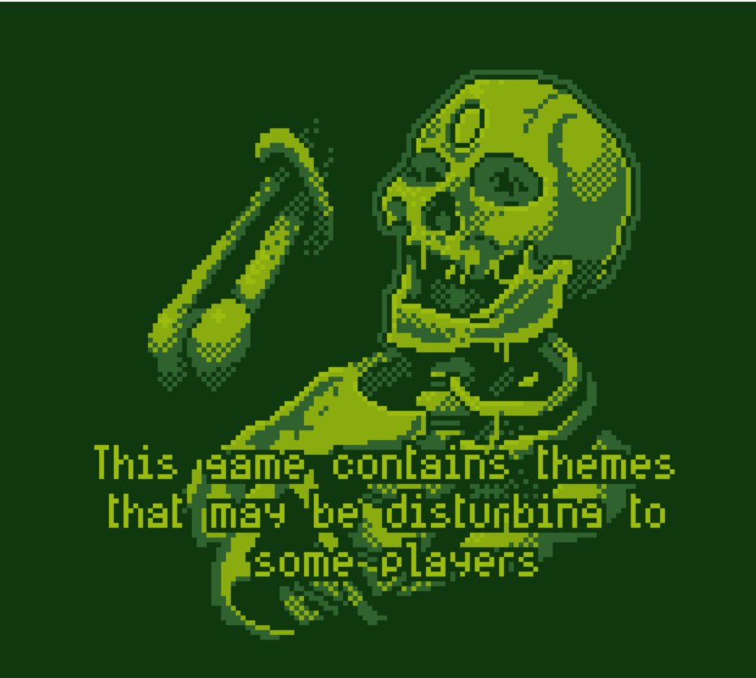
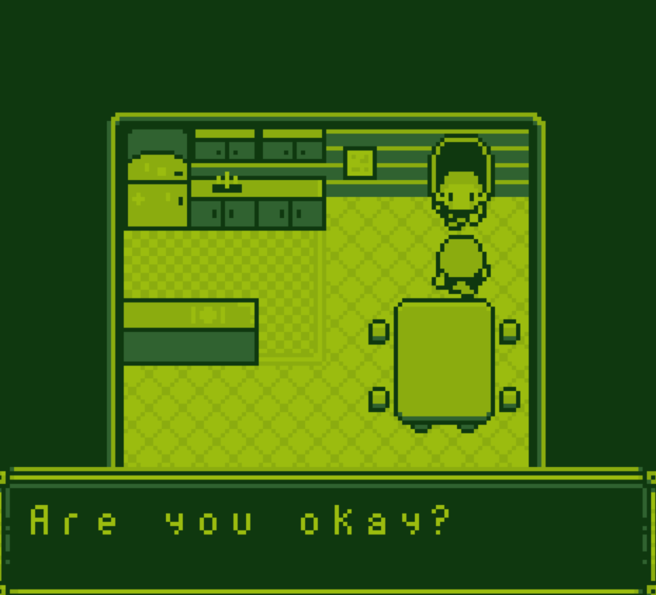
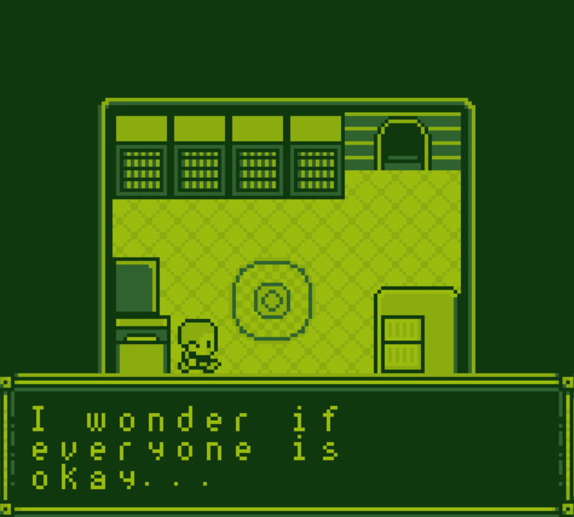

<div align="center">

# 🕹️ Game Boy Emulator

**A lightweight, modular, and cycle-accurate Nintendo Game Boy (DMG-01) emulator written in C17.**

[](https://en.wikipedia.org/wiki/C17_(C_standard_revision))
[](https://github.com/)
[](https://www.libsdl.org/)
[](https://cmake.org/)
[](LICENSE)

<br/>

<p align="center">
  
  
  
</p>

*Left: ROM loaded successfully (loading & warning splash screen) &bull; Center & Right: In-game dialogue & exploration during gameplay.*

</div>

---

## 📖 Table of Contents
- [About the Project](#-about-the-project)
- [Screenshots Showcase](#-screenshots-showcase)
- [Features](#-features)
- [Controls & Keybindings](#-controls--hotkeys)
- [Quick Start & Running](#-quick-start)
- [Building from Source](#-building-from-source)
- [Architecture & Code Structure](#-architecture)
- [Testing](#-testing)
- [License](#-license)

---

## 🌟 About the Project

This project is a clean-room, decoupled Game Boy (DMG) emulator built from the ground up in modern **C17**.

The core emulation library (`gb_core`) is strictly separated from any UI or platform frameworks:
- **Core Independence**: The emulation engine contains no SDL, OS, or graphics framework dependencies.
- **Cycle-Accurate Timing**: Emulates hardware cycles with scanline and clock-accurate state synchronization.
- **Portability**: Easily pluggable into various frontends, including the desktop **SDL2** interface as well as future mobile backends (Android NDK / iOS).

---

## 📸 Screenshots Showcase

<table>
  <tr>
    <td align="center" width="33%">
      <br/>
      <b>💀 Boot / Loading Screen</b><br/>
      <sub>Confirms ROM loading success & boot execution</sub>
    </td>
    <td align="center" width="33%">
      <br/>
      <b>💬 Story Dialogue</b><br/>
      <sub>PPU rendering text boxes, window overlays, and NPC sprites</sub>
    </td>
    <td align="center" width="33%">
      <br/>
      <b>🗺️ Exploration & Movement</b><br/>
      <sub>Background tilemaps, palette rendering, and collision</sub>
    </td>
  </tr>
</table>

---

## ⚡ Features

### 🧮 CPU (Sharp SM83 / LR35902)
- Complete implementation of the 8-bit instruction set and 16-bit register pairings (`AF`, `BC`, `DE`, `HL`, `SP`, `PC`).
- Full support for the extended `0xCB` opcode table (bit testing, bit setting, shifts, rotations).
- Accurate flag calculations (`Z`, `N`, `H`, `C`) and interrupt handling (`VBlank`, `LCD STAT`, `Timer`, `Serial`, `Joypad`).

### 🖼️ PPU (Pixel Processing Unit)
- Emulates the 160×144 pixel monochrome LCD with 4 shades of green / gray.
- Complete background layer, movable window layer, and 8×8 / 8×16 sprite (OAM) rendering.
- Accurate PPU modes: OAM Scan (Mode 2), Pixel Transfer (Mode 3), H-Blank (Mode 0), and V-Blank (Mode 1).

### 💾 Memory & Cartridge Bank Controllers (MBC)
- **MMU**: Fully mapped address bus with high-speed DMA sprite transfers.
- **Cartridge Support**:
  - `ROM Only` (No MBC)
  - `MBC1` (Up to 2MB ROM / 32KB RAM)
  - `MBC2` (Built-in 512×4-bit RAM)
  - `MBC3` (With Real-Time Clock / RTC support)
  - `MBC5` (High-capacity ROMs and RAM banking)

### 🎛️ Audio (APU)
- Multi-channel audio generation (Pulse channels with sweep/envelope, custom Wave pattern channel, and Noise channel).

### 🛠️ Developer & Quality-of-Life Tools
- **Save & Load States**: Instantly save snapshot states to disk and resume playback (`F5` / `F9`).
- **Interactive Disassembler / Debugger**: Real-time opcode disassembly, CPU register state dumps, cycle counters, and step execution.

---

## 🎮 Controls & Hotkeys

### Game Boy Joypad

| Game Boy Button | Keyboard Key (Primary) | Secondary Key |
| :--- | :--- | :--- |
| **D-Pad Up** | <kbd>▲ Up Arrow</kbd> | <kbd>W</kbd> |
| **D-Pad Down** | <kbd>▼ Down Arrow</kbd> | <kbd>S</kbd> |
| **D-Pad Left** | <kbd>◀ Left Arrow</kbd> | <kbd>A</kbd> |
| **D-Pad Right** | <kbd>▶ Right Arrow</kbd> | <kbd>D</kbd> |
| **A Button** | <kbd>Z</kbd> | <kbd>J</kbd> / <kbd>Space</kbd> |
| **B Button** | <kbd>X</kbd> | <kbd>K</kbd> |
| **Start** | <kbd>Enter</kbd> | <kbd>Keypad Enter</kbd> |
| **Select** | <kbd>Right Shift</kbd> | <kbd>Left Shift</kbd> |

### Emulator Hotkeys

| Function | Shortcut | Description |
| :--- | :--- | :--- |
| **Pause / Resume** | <kbd>P</kbd> | Freeze or resume emulation |
| **Save State** | <kbd>F5</kbd> | Quick-save game state to `gb.state` |
| **Load State** | <kbd>F9</kbd> | Quick-load game state from `gb.state` |
| **Toggle Debugger**| <kbd>F12</kbd> | Enable/disable live register and disassembler prints |
| **Step Instruction**| <kbd>N</kbd> | Step one instruction forward (when debugger is active) |
| **Exit** | <kbd>Esc</kbd> | Safely close the emulator window |

---

## 🚀 Quick Start

### 1. Switch to the Project Directory

* **PowerShell / Windows Terminal**:
  ```powershell
  cd D:\Gamebwoyemulator\GameboyEmulator
  ```
* **Command Prompt (`cmd`)**:
  ```cmd
  cd /d D:\Gamebwoyemulator\GameboyEmulator
  ```
* **Linux / macOS**:
  ```bash
  cd path/to/GameboyEmulator
  ```

### 2. Run the Game

Execute the desktop binary passing the path to your Game Boy ROM (`.gb`):

```powershell
.\build\gb_desktop.exe "path\to\your_rom.gb"
```

#### Optional CLI Arguments:
- **Set Window Scale** (Default is 4x):
  ```powershell
  .\build\gb_desktop.exe "path\to\your_rom.gb" --scale 3
  ```
- **Enable Debugger on Startup**:
  ```powershell
  .\build\gb_desktop.exe "path\to\your_rom.gb" --debug
  ```

---

## 🛠️ Building from Source

### Prerequisites
- **C Compiler**: Supporting **C17** (MSVC 2019+, GCC 9+, or Clang 10+)
- **CMake**: Version **3.16** or newer
- **SDL2**: Development libraries (installed via vcpkg, pacman, or system package manager)

### Build Instructions

```bash
# 1. Create and enter build directory
mkdir build
cd build

# 2. Configure project with CMake
cmake .. -DCMAKE_BUILD_TYPE=Release

# 3. Compile the executable and tests
cmake --build . --config Release
```

The compiled binary will be placed at `build/gb_desktop` (or `build\gb_desktop.exe` on Windows).

---

## 🏛️ Architecture

```
GameboyEmulator/
├── docs/
│   └── screenshots/        # Project images & gameplay captures
├── include/gb/             # Public core headers
│   ├── cpu.h               # CPU registers, state, and instructions
│   ├── ppu.h               # LCD controller, scanlines, and palettes
│   ├── mmu.h               # Memory mapping, I/O registers, and DMA
│   ├── apu.h               # Audio synthesis channels
│   ├── mbc.h               # Memory Bank Controller interfaces
│   ├── cartridge.h         # ROM header parsing and checksums
│   ├── debugger.h          # Disassembly and execution tracing
│   └── gb.h                # Main host interface & umbrella header
├── src/
│   ├── apu/                # Audio implementation
│   ├── cartridge/          # MBC0, MBC1, MBC2, MBC3, MBC5 drivers
│   ├── cpu/                # Instruction decoding & cycle execution
│   ├── debugger/           # Disassembler & debugging utilities
│   ├── joypad/             # Keypad input handling
│   ├── mmu/                # Memory bus routing & DMA logic
│   ├── ppu/                # Background, window, and sprite rendering
│   ├── timer/              # Hardware timer (DIV, TIMA, TMA, TAC)
│   └── main.c              # SDL2 Desktop frontend & application loop
├── tests/                  # Unit and integration test suite
└── CMakeLists.txt          # Root build configuration
```

---

## 🧪 Testing

The repository contains automated unit tests verifying CPU instructions, MMU banking, PPU timing, and MBC handling:

```bash
# Run tests via CTest
ctest --test-dir build --output-on-failure
```

---

## 📄 License

This project is licensed under the [MIT License](LICENSE). You are free to modify, distribute, and use it in your own projects.